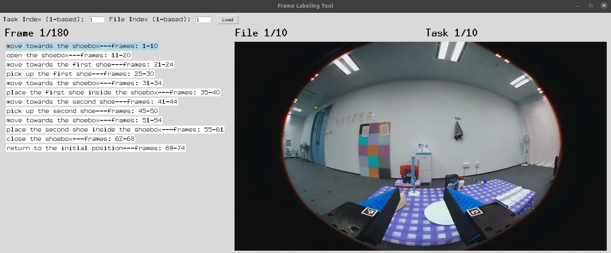

# annotation Labeling Tool 使用流程

以下内容将指导您从环境配置到最终保存标注结果的完整使用流程。即使您没有编程经验，也可以按步骤操作。

---

## 一、环境配置

1. **操作系统**  
   - Windows、macOS、Linux 均可运行，只需安装对应平台的 Python 3，推荐 Ubuntu。

2. **安装 Python 及依赖**  
   - 推荐 Python 3.7 及以上版本。  
   - 打开终端/命令行，执行：
     ```bash
     pip install numpy h5py pillow
     ```
   - 确保 `tkinter` 可用（通常随 Python 一同安装）。  
     - 如报错缺少 `tkinter`，请按系统：
       - **Ubuntu/Debian**：
         ```bash
         sudo apt-get update
         sudo apt-get install python3-tk
         ```

3. **使用 Conda 环境（推荐）**  
   - 创建并激活新的 Conda 环境（Python 3.7+）：
     ```bash
     conda create -n annotation python=3.8 -y
     conda activate annotation
     ```
   - 安装依赖包：
     ```bash
     conda install numpy h5py pillow -y
     ```
   - 安装 tkinter（部分 Conda 发行版可能不自带）：
     - **Ubuntu/Debian** 系统中仍需使用系统包管理器安装 `python3-tk`。  
     - macOS / Windows 通常自带，若缺少，可安装对应的 GUI 包或使用系统安装。
---


---

## 二、项目文件夹结构
项目根目录
```text
├── README.md
├── annotation_mannual.py
```
数据目录结构：

```text
data/
└── hdf5s/
    ├── Task_A/
    │   ├── video1.hdf5
    │   ├── video2.hdf5
    │   └── subtask.json
    ├── Task_B/
    │   ├── sample1.hdf5
    │   ├── sample2.hdf5
    │   └── subtask.json
    └── ...
```

1. **annotation_manual.py**  
   - 主脚本，执行后打开 GUI 界面。

2. **hny/hdf5s_song/**  
   - “任务根目录”，其中每个子文件夹（如 `Task_A/`）代表一个任务。  
   - 每个任务子文件夹中必须包含：  
     - 至少一个 `.hdf5` 文件（视频帧数据）。  
     - 一个 `subtask.json`，用于定义本任务的子任务列表。  
   - 程序运行时会在每个任务文件夹下自动创建一个 `json/` 子目录，用于保存标注结果。

---

## 三、准备数据（数据会提前准备好，因此这一步可以跳过）

1. **创建任务子文件夹**  
   - 在 `数据目录` 下，为每个任务新建一个子文件夹（名称可任意）。  

2. **放置 HDF5 文件**  
   - 将待标注的视频（HDF5 格式）拷贝到对应任务文件夹内，文件扩展名必须为 `.hdf5`。  

3. **编写 subtask.json (该文件会提前准备好，因此这一步可以跳过)**  
   - 在每个任务文件夹内创建 `subtask.json`，内容示例：
     ```json
     [
       { "step": "Step1", "content": "move towards the shoebox" },
       { "step": "Step2", "content": "open the shoebox" },
       { "step": "Step3", "content": "move towards the first shoe" },
       { "step": "Step4", "content": "pick up the first shoe" }
     ]
     ```
   - `step`：阶段标签，可自定义。  
   - `content`：子任务描述，将显示在 GUI 左侧。

---

## 四、启动程序

1. 打开终端/命令提示符。  
2. 切换到项目根目录：
   ```bash
   cd /annotation_mannual目录
3. 运行脚本：
    ```bash
   python3 frame_labeling_tool.py
   ```
    如果 python3 无法识别，也可用：
   ```bash    
   python frame_labeling_tool.py
   ```


## 五、GUI 界面功能与操作

 程序启动后会自动加载：默认第 1 个任务（Task A）内的第 1 个 .hdf5 文件。
    界面顶部显示 Frame/File/Task 信息，左侧显示本任务的子任务列表，右侧显示当前帧图像。


### 1. 顶部索引输入区

- **Task Index (1-based)**  
  输入要加载的任务序号，从 1 开始计数。

- **File Index (1-based)**  
  输入要加载的 .hdf5 文件序号，从 1 开始计数。

- **Load 按钮**  
  填写索引后点击即可跳转到指定任务文件及其指定 .hdf5。

> **注意：**  
> - Task Index 范围：1 到任务总数（任务根目录下文件夹数量）。  
> - File Index 范围：1 到当前任务下 .hdf5 文件个数。

---

### 2. 状态显示区

- **Frame x/y**：当前帧的索引（1-based）及总帧数。
- **File x/y**：当前加载的 .hdf5 文件索引（1-based）及该任务下总文件数。
- **Task x/y**：当前任务索引（1-based）及任务总数。

---

### 3. 左侧：子任务列表

- 显示 `subtask.json` 中定义的所有 `content` 字段。
- 当前等待标注的子任务会被高亮（背景色变为浅蓝色）。

---

### 4. 右侧：图像显示区

- 显示当前 .hdf5 视频的单帧图像（缩放至原大小的 ½ 以加快显示）。

---

### 5. 快捷键操作

- `←`（左箭头）  
  切换到上一帧（若当前帧 > 1）。

- `→`（右箭头）  
  切换到下一帧（若当前帧 < 总帧数）。

- `Space`（空格）  
  标注当前子任务：
  - 自动记录从“上一次标注结束帧 + 1”到“当前帧”的区间 `start-end`；
  - 读取该子任务的 `step` 和 `content`；
  - 将 `{ "step": ..., "label": ..., "frame": "start-end" }` 追加到标注列表；
  - 下一个子任务高亮；
  - 若本任务已标注完毕，弹窗提示“所有子任务已标注完毕！”。

- `u`（小写字母 U）  
  撤销上一次标注：
  - 从内存列表中删除最后一个标注条目；
  - 将 `current_subtask_index` 回退 1，并将下次标注起点重置为该条目起始帧；
  - 更新左侧高亮状态。

- `s`（小写字母 S）  
  保存并跳转：
  - 检查是否所有子任务都已标注完毕，若未完成弹窗提示并阻止保存；
  - 将当前内存中所有标注写入当前任务的 `json/{hdf5_filename}.json`；
  - 弹窗提示“保存成功”并显示保存路径；
  - 自动跳转至当前任务下一个 .hdf5 文件或下一个任务的第 1 个 .hdf5；
  - 如果最后一个任务的最后一个 .hdf5 已完成，则弹窗提示“所有任务都已标注完毕！”并退出程序。

- `Esc`（Esc 键）  
  询问是否退出程序，确认后退出。

> **温馨提示：**  
> 退出前请务必保存，否则当前内存中的标注会丢失。

## 六、标注保存与查看

### 自动创建并保存目录

- 程序会在每个任务文件夹下自动创建一个 `json/` 子目录（若不存在）。
- 按 `s` 键保存时，会在该目录生成 `{hdf5_basename}_manual.json` 文件。

---


### 标注 JSON 格式示例

```json
[
  {
    "step": "Step1",
    "label": "move towards the shoebox",
    "frame": "1-10"
  },
  {
    "step": "Step2",
    "label": "open the shoebox",
    "frame": "11-20"
  }
  // ……
]
```
## 七、常见问题与解决

### 无法找到 `subtask.json`

- 请检查任务文件夹中是否存在 `subtask.json`，且文件名无误（大小写敏感）。
- 确保 `subtask.json` 格式合法，并包含 `step` 和 `content` 字段。

---

### Task Index / File Index 输入报错

- 输入需为整数，且基于 1 开始计数：
  - **Task Index**：介于 1 到任务总数之间；
  - **File Index**：介于 1 到当前任务下 `.hdf5` 文件数之间。
- 若超出范围，点击 **Load** 后会弹窗提示。

---

### 图像显示空白或异常

- 确认 `.hdf5` 文件中存在路径：`observations/images/front`。
- 可用以下脚本检查 HDF5 结构：

```python
import h5py

f = h5py.File("your_video.hdf5", 'r')
print(list(f.keys()))
# 确认 'observations'、'images'、'front' 是否存在
```
## 八、功能列表一览

### 1. 加载／跳转任务与文件
- 在顶部输入 **Task Index (1-based)** 和 **File Index (1-based)**，点击 **Load** 进行跳转。

### 2. 切换视频帧
- 使用 `← / →` 切换上一帧 / 下一帧。

### 3.标注子任务
- 按 `Space` 自动记录当前区间与子任务信息，保存至内存标注列表；
- 左侧子任务自动高亮跳转至下一个。

### 4.撤销上一条标注
- 按 `u` 撤销上一条标注，恢复上一个子任务及其区间起始帧。

### 5.保存并跳转
- 按 `s`：
  - 保存当前标注至 JSON；
  - 弹窗提示保存路径；
  - 自动跳转至下一个文件或任务。

### 退出程序
- 按 `Esc` 弹窗确认后退出；
- **注意：未保存的标注将丢失**。

## 十、联系方式与反馈

如在使用过程中遇到问题或需定制功能，可联系：

- **地址**：604化学品架子这排的两个人

祝使用顺利！如果对本文档有任何疑问或补充需求，欢迎及时反馈并更新。
